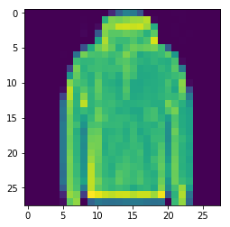
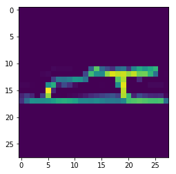

```python
import torch
import torch.nn as nn
import torch.nn.functional as F
import torch.optim as optim
import torchvision
import torchvision.transforms as transforms
import gzip
import os
import numpy as np
import matplotlib.pyplot as plt
import argparse

import tqdm

torch.set_printoptions(linewidth=100)
```


```python
def load_mnist(path, kind='train'):

    """Load MNIST data from `path`"""
    labels_path = os.path.join(path,
                               '%s-labels-idx1-ubyte.gz'
                               % kind)
    images_path = os.path.join(path,
                               '%s-images-idx3-ubyte.gz'
                               % kind)

    with gzip.open(labels_path, 'rb') as lbpath:
        labels = np.frombuffer(lbpath.read(), dtype=np.uint8,
                               offset=8)

    with gzip.open(images_path, 'rb') as imgpath:
        images = np.frombuffer(imgpath.read(), dtype=np.uint8,
                               offset=16).reshape(len(labels), 784)

    return images, labels
```


```python
train_images, train_labels = load_mnist(r"E:\DATA SETS & compressed\fashion data")
```


```python
train_images.shape, train_labels.shape
```


    ((60000, 784), (60000,))


```python
test_images, test_labels = load_mnist(r'E:\DATA SETS & compressed\fashion data', kind='t10k')
```


```python
test_images.shape, test_labels.shape
```


    ((10000, 784), (10000,))


```python
train_images = train_images.reshape((60000, 28, 28))
test_images=test_images.reshape((10000, 28, 28))
```


```python
a = train_images[4545]
```


```python
a.shape
```


    (28, 28)


```python
plt.imshow(a)
plt.show()
```





```python
train_data = []
test_data = []
for i in range(len(train_images)):
    train_data.append([train_images[i], train_labels[i]])
for i in range(len(test_images)):
    test_data.append([test_images[i], test_labels[i]])
```


```python
trainloader = torch.utils.data.DataLoader(train_data, shuffle=True, batch_size=100)
testloader = torch.utils.data.DataLoader(test_data, shuffle=True, batch_size=100, )
```


```python
i1, l1 = next(iter(trainloader))
i2, l2 = next(iter(testloader))
```


```python
num = 55
plt.imshow(i1[num])
print(l1[num])
```

    tensor(5, dtype=torch.uint8)
    





```python
'''
0 - tshirt
1 - trouser
2 - pullover
3 - dress
4 - coat
5 - sandal
6 - shirt
7 - sneakers
8 - bag
9 - ankle boot
'''
```


    '\n0 - tshirt\n1 - trouser\n2 - pullover\n3 - dress\n4 - coat\n5 - sandal\n6 - shirt\n7 - sneakers\n8 - bag\n9 - ankle boot\n'


```python
l1
```


    tensor([5, 9, 3, 1, 5, 7, 5, 5, 9, 7, 4, 9, 9, 4, 8, 4, 0, 6, 4, 1, 9, 4, 7, 3, 0, 5, 6, 8, 3, 2, 5,
            8, 7, 9, 5, 3, 9, 8, 5, 6, 3, 5, 4, 3, 2, 3, 3, 3, 8, 4, 2, 6, 1, 6, 6, 5, 1, 0, 0, 7, 7, 6,
            4, 2, 1, 7, 7, 8, 5, 3, 4, 7, 2, 6, 2, 8, 2, 3, 1, 1, 3, 9, 6, 2, 1, 4, 1, 1, 3, 9, 0, 7, 0,
            0, 4, 6, 7, 8, 7, 9], dtype=torch.uint8)


```python
i1.shape
```


    torch.Size([100, 28, 28])


```python
#start the model.
```
